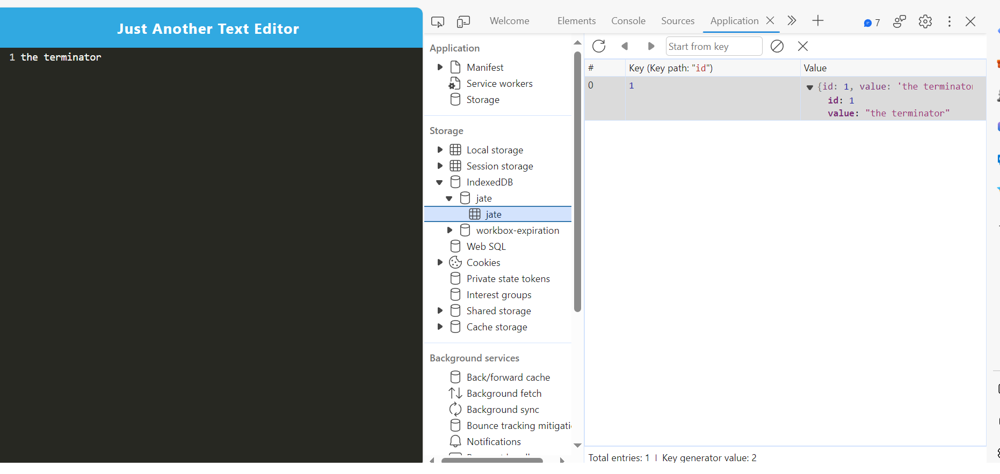

## PWA-Text-Editor

## description
In this assignment, the goal is to create a robust Progressive Web Application (PWA) using a text editor as the central functionality. The application will encompass various modern web development practices to ensure optimal performance, offline functionality, and a seamless user experience. Our data for this assignment get stored in a hyberseed version of local storage called the index db. For this example we named it "Jate"

## application img'

## URL
https://github.com/ShahanAmeen/PWA-Text-Editor

https://shahanameen.github.io/PWA-Text-Editor/

## Author
Shahan Ameen
https://github.com/ShahanAmeen 
